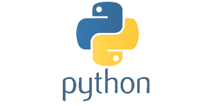
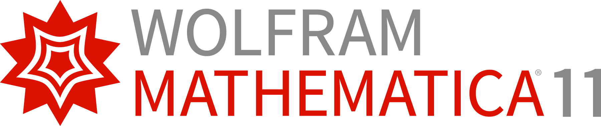
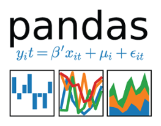
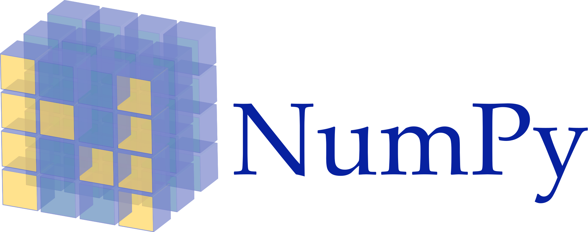
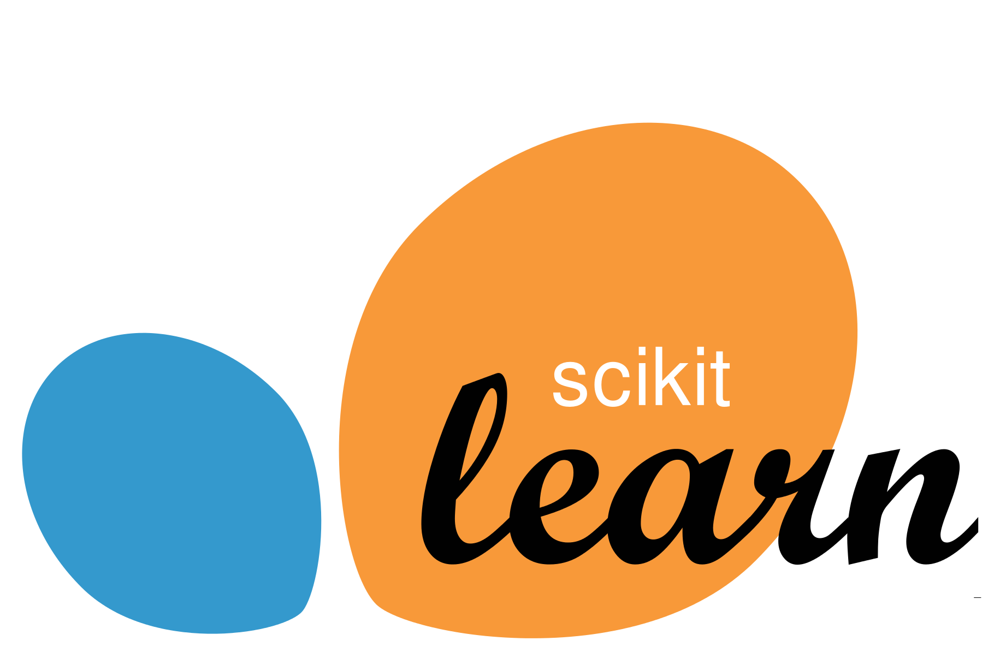
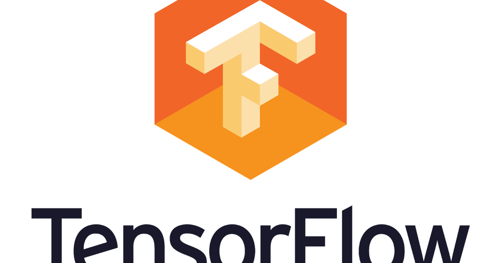
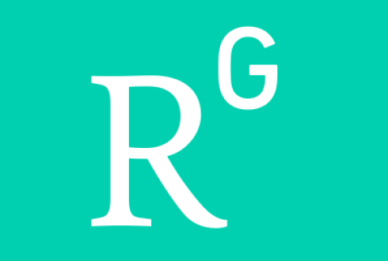
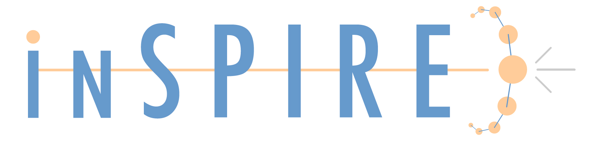

## Who am I?
First of all, I am a human being and after that I am a son, a brother, a student, a researcher and a programmer.
I am a PhD student of particles physics at <a href="http://ipm.ac.ir/">IPM</a> in <a href="https://en.wikipedia.org/wiki/Tehran">Tehran</a>, <a href="https://en.wikipedia.org/wiki/Iran">Iran</a>. I was born in November, 1990, so I am 29 years old now. 

## Publications
My publications in particle physics phenomenology:
### [HEP-PH](hep-ph-publications.md)
	
## Main Skills

<table border="0">
	<thead>
		<th></th>
		<th></th>
		<th></th>
                <th></th>
	</thead>
	<tr>
		<td><strong>Programming</strong></td>
                <td> C++</td>
		<td> Python</td>
		<td> Mathematica</td>
	</tr>
	<tr>
		<td><strong>Data Analysis</strong></td>
		<td><a href="https://root.cern.ch/"> root</a></td>
		<td><a href="https://pandas.pydata.org/"> pandas</a>    
			<a href="http://www.numpy.org/"> numpy</a>   
			<a href="https://matplotlib.org/"> matplotlib</a></td>
		<td></td>
	</tr>
	<tr>
		<td><strong>Machine Learning</strong></td>
		<td><a href="https://root.cern.ch/tmva"> TMVA</a></td>
		<td><a href="https://scikit-learn.org/"> scikit-learn</a> 
            <a href="http://keras.io/"> keras</a> 
            <a href="https://www.tensorflow.org/">  tensorflow</a>
        </td>
		<td></td>
	</tr>
</table>

## Contact
IPM :       javadebadi@ipm.ir 
CERN:       javad.ebadi@cern.ch 
 
javad.ebadi.1990@gmail.com 

